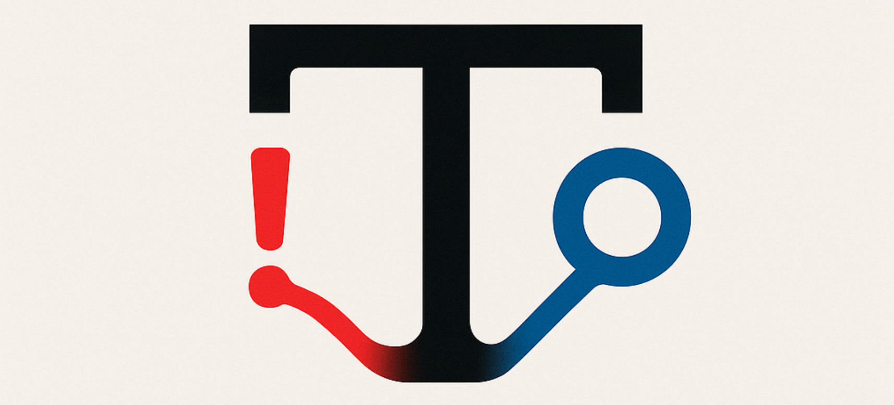

[](https://scala-steward.org)  
# The future of scala.concurrent.Future

___
## :star2: Why this library?

`Task` is a lightweight monad which is built on top of `scala.concurrent.Future`, but with a type parameter for the 
error type. The advantage of this is that if a function return a `Task[DomainException, Int]` it can only fail
with an error which is a subtype of `DomainException` (or a fatal exception). 

`Task` can also be used interchangeably with the `Future` monad and has the same performance. 
This means that you do not need to learn or introduce a new effect system to your codebase and your code 
can use the same libraries that you are already using with `Future`. Finally, this library is designed to be as
lightweight as possible, and has no dependencies.

### :toolbox: Similar Libraries
If you are already used to working with typed errors and instead want to go the extra mile to
change effect system I would recommend checking out [ZIO](https://zio.dev/overview/getting-started)
or [Monix BIO](https://bio.monix.io/docs/introduction).

## Getting Started
### :gear: Installation
Setup via `build.sbt`:

```sbt
libraryDependencies += "io.github.ragazoor" %% "task" % "0.1.17"
```

### Examples

- Basic usage [link](examples/src/main/scala/io/github/ragazoor/task/examples/basic/BasicMain.scala):
  - Code with error types 
  - Conversion from `Future` to `Task`
  - Mapping errors `Throwable` to custom error type
- Interoperability with `scala.concurrent.Future` libraries [link](examples/src/main/scala/io/github/ragazoor/task/examples/interop/InteropMain.scala):
- Migrating from `scala.concurrent.Future` to `Task` [link](examples/src/main/scala/io/github/ragazoor/task/examples/migration/MigrationExample.scala):

## Migration

The goal of this library is to be as lightweight as possible, with this in mind I am reusing as much as possible
from `scala.concurrent.*`. This makes migration easy as well, it is mostly about replacing 
`scala.concurrent.Future` with `io.github.ragazoor.task.*` and `io.github.ragazoor.task.implicits.*`.

You have to fix the code manually mainly in the following ways:

- If we are using a third-party library returning a `scala.concurrent.Future`
  we need to convert it to `Task` using `.toTask` and the implicit class in
  `io.github.ragazoor.task.implicits.FutureToTask`.
- If we are using implicit classes which act on `scala.concurrent.Future`, fix the 
  implicit class or convert task to `Future` using `.toFuture`
- If you have interfaces in your code like `A => StdFuture[B]`, which are hard to change,
  there are implicits in `import io.github.ragazoor.task.migration.implicits._` to help.
- If you are using implicit classes that extends `scala.concurrent.Future`
  the compiler will not be able to convert
  like one might think using the migration implicits. So we need to make
  it explicit:

## Benchmarks
Run benchmarks with
```shell
sbt "benchmark/jmh:run -i 10 -wi 10 -f 1 -t 1 io.github.ragazoor.task.TaskBenchmark"
```

```text
[info] Benchmark                      Mode  Cnt   Score   Error  Units
[info] TaskBenchmark.futureFlatMap   thrpt   10  34.419 ± 1.406  ops/s
[info] TaskBenchmark.futureMap       thrpt   10  34.556 ± 0.850  ops/s
[info] TaskBenchmark.futureRecover   thrpt   10  33.102 ± 0.802  ops/s
[info] TaskBenchmark.futureSequence  thrpt   10   1.858 ± 0.019  ops/s
[info] TaskBenchmark.taskFlatMap     thrpt   10  34.451 ± 0.961  ops/s
[info] TaskBenchmark.taskMap         thrpt   10  36.490 ± 1.042  ops/s
[info] TaskBenchmark.taskMapError    thrpt   10  35.284 ± 1.302  ops/s
[info] TaskBenchmark.taskSequence    thrpt   10   1.558 ± 0.047  ops/s
```
